# Hi, I'm Alexey Rtischew

<picture>
  <source media="(prefers-color-scheme: dark)" srcset="./dark.svg">
  <source media="(prefers-color-scheme: light)" srcset="./light.svg">
  
</picture>

---

### About

AI Integration Developer and Full-Stack PHP Developer focused on business automation, commercial web systems, WordPress solutions, SEO, and REST API integrations.

- **Focus:** AI integrations · Automation · SEO · Business web systems
- **Stack:** PHP 8.4 · Laravel · WordPress · WooCommerce · Vue 3 · Quasar 2 · MySQL
- **Availability:** Remote / Contract
- **Website:** [delay-delo.com](https://delay-delo.com)
- **GitHub:** [@monklock](https://github.com/monklock)

---

### Tech Stack

